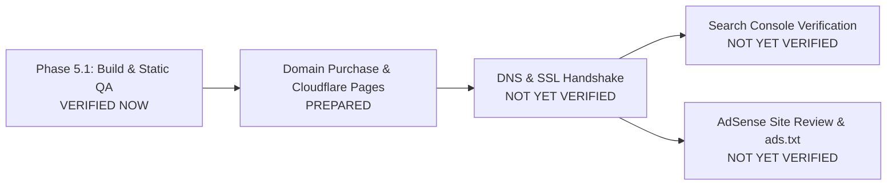

# PDFSimplify — Production Launch & Domain Activation Checklist

**Document**: Production Launch Manual & Pre-Flight Runbook  
**Domain**: `pdfsimplify.com` (Pending Purchase)  
**Architecture**: 100% Client-Side In-Browser Execution, Zero Backend, Next.js Static Export (`output: 'export'`)  
**Status Key**:
* **[VERIFIED NOW]**: Empirically audited and verified via automated test suites, Chrome DevTools Protocol (CDP), and Lighthouse static testing.
* **[PREPARED]**: Architecturally configured in source code, build configs, and deployment headers, ready for immediate execution upon domain acquisition.
* **[NOT YET VERIFIED]**: External third-party registrations and live network verifications that require an active domain, DNS propagation, and live traffic.

---

## 1. Status Overview



---

## 2. Verification Status Matrix

### Category A: [VERIFIED NOW] (Local & Static Baseline)
- [x] **Zero-Backend Invariant**: Exactly 0 API routes, 0 server actions, 0 databases, 0 cloud file upload endpoints.
- [x] **Client-Side PDF Engines**: `pdf-lib`, Mozilla `PDF.js`, `@pdfsmaller/pdf-encrypt`, `@pdfsmaller/pdf-decrypt`, Web Workers fully functional.
- [x] **Static Prerendering**: 47 static HTML/JS/CSS routes exported cleanly into `out/`.
- [x] **Automated Test Suite**: 279 / 279 automated tests passing across 61 test suites.
- [x] **Type Safety & Lint**: 0 TypeScript errors (`tsc --noEmit`), 0 ESLint warnings (`npm run lint`).
- [x] **Network Privacy CDP Audit**: 798 network requests audited — 0 POST/PUT/PATCH requests, 0 bytes of document data leaked.
- [x] **Desktop Core Web Vitals**: Lighthouse Desktop (Perf: 99, A11y: 94, Best: 100, SEO: 100, CLS: 0.000).
- [x] **Mobile Layout Stability**: Lighthouse Mobile CLS: 0.000 (layout reservation prevents shifts).
- [x] **SEO Schema.org JSON-LD**: `WebApplication`, `FAQPage`, `Article`, `BreadcrumbList`, and `WebSite` validated.
- [x] **Editorial Content Graph**: 16 comprehensive guides with reciprocal tool linking.
- [x] **PWA Assets**: `manifest.webmanifest`, 192px/512px/maskable icons, `/sw.js` precaching `/pdf.worker.min.mjs`.
- [x] **Editor Ad Isolation**: Zero ads inside visual editor workspace; zero bottom anchor ads on editor.
- [x] **Legal Page Ad Blacklist**: Zero ads on `/privacy-policy`, `/terms`, `/cookie-policy`, `/contact`.
- [x] **Centralized Site Config**: Domain, URLs, and emails consolidated in `src/config/site.ts`.
- [x] **No Fake ads.txt**: Verified absence of fake placeholder publisher IDs (`pub-XXXXXXXXXXXXXXXX`) in public assets.

---

### Category B: [PREPARED] (Code & Config Ready for Activation)
- [ ] **Cloudflare Pages Headers**: `out/_headers` prepared with CSP, HSTS, X-Frame-Options, MIME protection, and SW cache control.
- [ ] **Sitemap Generator**: `sitemap.xml` prepared with 40 canonical indexable URLs.
- [ ] **Robots.txt Directive**: `robots.txt` prepared pointing directly to `https://pdfsimplify.com/sitemap.xml`.
- [ ] **Centralized Origin Swapping**: `NEXT_PUBLIC_SITE_URL` wired into all metadata, JSON-LD, and canonical tags.
- [ ] **AdSense Integration Harness**: `NEXT_PUBLIC_ADSENSE_CLIENT_ID` and `NEXT_PUBLIC_ADSENSE_ENABLED` wired into `AdSlot` and `AnchorAd`.
- [ ] **Clean 404 Routing**: Custom `404.html` and `_not-found.html` exported in `out/` for static host fallback.
- [ ] **Nginx / Docker Manual**: Fallback self-hosted configuration ready in `DEPLOYMENT.md`.

---

### Category C: [NOT YET VERIFIED] (Pending External Domain & Services)
- [ ] **Domain Registration**: Purchase `pdfsimplify.com` on registrar (Ashewa Cloud, Cloudflare Registrar, etc.).
- [ ] **Live DNS Resolution**: Configure A/AAAA/CNAME records pointing to Cloudflare Pages edge.
- [ ] **Public SSL/TLS Handshake**: Edge certificate provisioning and HTTP $\to$ HTTPS 301 redirect.
- [ ] **Google Search Console**: Domain property ownership verification via DNS TXT record.
- [ ] **Google Search Indexing**: Live sitemap processing and crawling of tool and guide URLs.
- [ ] **Google AdSense Site Application**: Submission of live website for Google Publisher Policy review.
- [ ] **Live ads.txt Deployment**: Publishing verified publisher ID (`google.com, pub-YYYYYYYYYYYYYYYY, DIRECT, f08c47fec0942fa0`).
- [ ] **Real-Device Mobile Performance**: CrUX Core Web Vitals field data collection on physical hardware.

---

## 3. Step-by-Step Post-Domain Activation Runbook

Execute these steps in strict chronological order once `pdfsimplify.com` is acquired.

### Step 1: Domain Purchase & DNS Delegation
1. Acquire `pdfsimplify.com` through Ashewa Cloud or your preferred domain registrar.
2. If using Cloudflare Pages, assign domain nameservers to Cloudflare:
   ```
   ns1.cloudflare.com
   ns2.cloudflare.com
   ```
3. Enable DNSSEC in your registrar dashboard.

### Step 2: Cloudflare Pages Deployment
1. Log in to the Cloudflare Dashboard $\to$ **Compute (Workers & Pages)** $\to$ **Create application** $\to$ **Pages** $\to$ **Connect to Git**.
2. Select repository: `pdf-utility-website`.
3. Configure Build Settings:
   - **Framework preset**: `Next.js (Static HTML Export)`
   - **Build command**: `npm run build`
   - **Build output directory**: `out`
   - **Node.js Version**: `20` or `22` (Set environment variable `NODE_VERSION=22`)
4. Click **Save and Deploy**.
5. Once build completes, navigate to **Custom Domains** $\to$ **Set up a custom domain**.
6. Enter `pdfsimplify.com` and `www.pdfsimplify.com`. Cloudflare automatically provisions edge SSL/TLS.

### Step 3: Production DNS & HTTPS Sanity Check
Run the following curl commands against the live domain:

```bash
# 1. Verify HTTP -> HTTPS 301 redirect
curl -I http://pdfsimplify.com

# 2. Verify HTTPS response, HSTS, and Security Headers
curl -I https://pdfsimplify.com

# 3. Verify Service Worker header (must NOT be cached)
curl -I https://pdfsimplify.com/sw.js
# Expected: Cache-Control: no-cache, no-store, must-revalidate

# 4. Verify static worker caching
curl -I https://pdfsimplify.com/pdf.worker.min.mjs
# Expected: Cache-Control: public, max-age=31536000, immutable

# 5. Verify sitemap accessibility
curl -s -o /dev/null -w "%{http_code}\n" https://pdfsimplify.com/sitemap.xml
# Expected: 200
```

### Step 4: Google Search Console Verification
1. Navigate to [Google Search Console](https://search.google.com/search-console).
2. Choose **Domain Property** and enter `pdfsimplify.com`.
3. Copy the provided `google-site-verification` TXT record value.
4. Add the TXT record in Cloudflare DNS:
   - **Type**: `TXT`
   - **Name**: `@` (or `pdfsimplify.com`)
   - **Content**: `google-site-verification=...`
   - **TTL**: Auto
5. Click **Verify** in Google Search Console.
6. Once verified, open **Sitemaps** in the sidebar:
   - Enter `sitemap.xml` and click **Submit**.
   - Verify that all 40 indexable URLs are discovered.

### Step 5: Real-World In-Browser Smoke Test (Live Domain)
1. Open Chrome Incognito $\to$ `https://pdfsimplify.com`.
2. Test `/pdf-tools/merge-pdf`:
   - Drop 2 test PDFs.
   - Click **Merge PDF**.
   - Confirm instant client-side merge and download.
3. Test `/pdf-tools/pdf-editor`:
   - Load sample PDF.
   - Add text, pencil drawing, signature.
   - Confirm export completes locally.
4. Verify PWA:
   - Open DevTools $\to$ Application $\to$ Service Workers (Confirm `/sw.js` is active).
   - Toggle **Offline** mode in Network tab.
   - Reload page (Confirm offline continuity banner renders and tools continue running).

### Step 6: Google AdSense Account Application & Live ads.txt Activation
> [!IMPORTANT]
> Do NOT create or publish `ads.txt` with placeholder credentials. Only perform this step after you have an active AdSense account.

1. Once the site is live with organic traffic and indexed pages, apply for Google AdSense via [google.com/adsense](https://www.google.com/adsense/).
2. Submit `https://pdfsimplify.com` for review.
3. Upon approval, locate your Publisher ID: `pub-YYYYYYYYYYYYYYYY`.
4. Create `public/ads.txt`:
   ```txt
   google.com, pub-YYYYYYYYYYYYYYYY, DIRECT, f08c47fec0942fa0
   ```
5. In your Cloudflare Pages environment variables, add:
   ```env
   NEXT_PUBLIC_ADSENSE_CLIENT_ID=ca-pub-YYYYYYYYYYYYYYYY
   NEXT_PUBLIC_ADSENSE_ENABLED=true
   ```
6. Trigger a production build:
   ```bash
   git add public/ads.txt
   git commit -m "chore(ads): deploy verified ads.txt and enable AdSense"
   git push origin main
   ```
7. Verify live `ads.txt`:
   ```bash
   curl -I https://pdfsimplify.com/ads.txt
   # Expected: HTTP 200 with text/plain
   ```

### Step 7: Real-Device Mobile & Performance Verification
1. Run PageSpeed Insights against `https://pdfsimplify.com`:
   - Record Desktop Performance (target $\ge 95$).
   - Record Mobile Performance.
2. Test on physical iOS Safari and Android Chrome devices:
   - Verify pinch-to-zoom is not disabled.
   - Verify mobile bottom anchor ad dismiss button works with one tap.
   - Verify file picker triggers native document selector.
