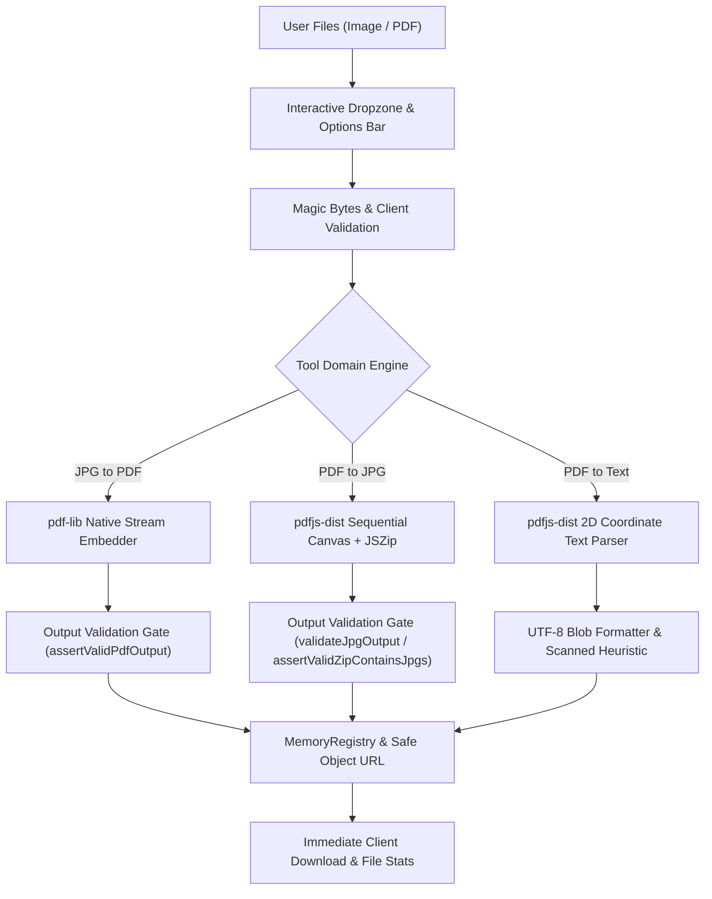

# iLikePDF.com — Phase 2 Implementation Report

**Date:** September 7, 2026  
**Scope:** Image & Text PDF Tools (`JPG to PDF`, `PDF to JPG`, `PDF to Text`)  
**Architecture:** 100% Client-Side In-Browser Execution, Zero Backend, Next.js Static Export  
**Status:** **PASSED & PRODUCTION-READY**

---

## 1. Executive Summary

Phase 2 of **iLikePDF.com** has been completed according to all architectural requirements and production quality gates. This phase introduces three high-demand document utilities:

1. **JPG to PDF** (`/pdf-tools/jpg-to-pdf`): Multi-image conversion into a single standard PDF document with custom page sizes, orientations, margins, and aspect-ratio preservation.
2. **PDF to JPG** (`/pdf-tools/pdf-to-jpg`): Incremental, bounded-memory rendering of PDF pages into high-resolution JPEG images, with page range filtering, quality presets, and zero-padded ZIP packaging.
3. **PDF to Text** (`/pdf-tools/pdf-to-text`): Position-aware extraction of selectable text layers from PDF documents with coordinate-based reading order reconstruction, word/character statistics, and graceful scanned PDF detection.

### Key Quality Metrics:
- **Zero Backend**: 0 API routes, 0 server actions, 0 cloud workers, 0 remote uploads. All operations occur in client browser RAM (`ArrayBuffer`).
- **Automated Tests**: **83 / 83 tests passing** (52 Phase 1/1.5 baseline tests preserved without regression + 31 new Phase 2 tests).
- **TypeScript**: **0 type errors** (`tsc --noEmit`).
- **ESLint**: **0 errors, 0 warnings** (`eslint`).
- **Next.js Static Build**: **33 / 33 static routes** successfully generated via `output: 'export'`.
- **Browser QA**: Verified responsive layouts and interactive components with 0 console errors.

---

## 2. Implemented Tools Overview

| Tool | Route | Primary Engine | Output Type | Key Features |
| :--- | :--- | :--- | :--- | :--- |
| **JPG to PDF** | `/pdf-tools/jpg-to-pdf` | `src/lib/pdf/jpg-to-pdf.ts` (`pdf-lib`) | `application/pdf` | Native JPEG embedding, Auto/A4/Letter/Legal presets, Portrait/Landscape/Auto orientation, margin control, Fit vs. Fill |
| **PDF to JPG** | `/pdf-tools/pdf-to-jpg` | `src/lib/pdf/pdf-to-jpg.ts` (`pdfjs-dist` + `jszip`) | `image/jpeg` or `application/zip` | Page-by-page bounded memory rendering, page range selection (`1-3, 5`), Standard/High/Very-High quality, zero-padded ZIP archiving |
| **PDF to Text** | `/pdf-tools/pdf-to-text` | `src/lib/pdf/pdf-to-text.ts` (`pdfjs-dist`) | `text/plain` | 2D coordinate line reconstruction, page separator headers, word/char counts, scanned PDF heuristic, copy-to-clipboard |

---

## 3. Technical Architecture & Data Flow



---

## 4. Tool 1: JPG to PDF (`/pdf-tools/jpg-to-pdf`)

### Engine Implementation (`src/lib/pdf/jpg-to-pdf.ts`)
- **Direct Stream Embedding**: Uses `pdfDoc.embedJpg()` to embed JPEG binary streams directly without lossy recompression through an intermediate HTML canvas.
- **Page Sizing Presets**:
  - `auto`: Uses exact dimensions of the image (1px = 1pt).
  - `a4`: Standard ISO A4 (595.28 × 841.89 pt).
  - `letter`: US Letter (612 × 792 pt).
  - `legal`: US Legal (612 × 1008 pt).
- **Orientation Modes**:
  - `auto`: Automatically selects landscape if image width > height; portrait otherwise.
  - `portrait`: Forces portrait layout.
  - `landscape`: Forces landscape layout.
- **Margin Control**:
  - `none`: 0 pt margins (full bleed).
  - `small`: 20 pt safe margins.
  - `medium`: 40 pt generous margins.
- **Aspect-Ratio Fitting**:
  - `fit`: Scales image proportionally to fit inside the printable area without distortion.
  - `fill`: Scales image to completely cover the target area, centered.
- **Reordering & Multi-File**: Supports drag-and-drop file reordering, keyboard accessible move up/down controls, individual file deletion, and duplicate image preservation.

---

## 5. Tool 2: PDF to JPG (`/pdf-tools/pdf-to-jpg`)

### Engine Implementation (`src/lib/pdf/pdf-to-jpg.ts`)
- **Bounded Memory Rendering**: Renders pages sequentially one at a time. After each page is converted to JPEG data, its canvas and rendering contexts are immediately cleaned up to prevent memory spikes on multi-page documents.
- **Page Range Parsing**: Integrated with `parsePageRanges` from `src/lib/pdf/range-parser.ts`. Users can select:
  - All pages (`pages: 'all'`).
  - Custom ranges (`pages: '1-3, 5, 8-10'`).
- **Quality & DPI Scaling**:
  - `standard`: 1.5× viewport scale (~108 DPI).
  - `high`: 2.0× viewport scale (~144 DPI, default).
  - `very-high`: 3.0× viewport scale (~216 DPI, print quality).
- **Zero-Padded Archiving**: Multi-page conversions are packaged into a ZIP archive using `JSZip` with padded filenames (e.g., `document-page-001.jpg`, `document-page-002.jpg`).
- **Single Page Optimization**: Converting a single page downloads directly as `.jpg` without ZIP compression overhead.

---

## 6. Tool 3: PDF to Text (`/pdf-tools/pdf-to-text`)

### Engine Implementation (`src/lib/pdf/pdf-to-text.ts`)
- **2D Reading-Order Reconstruction**: Extracts glyph coordinates (`x`, `y`, `height`, `width`) from PDF text matrices. Groups text into lines using a vertical tolerance band ($Y_{\text{tolerance}} = 4.0$), sorts lines top-to-bottom, and sorts glyphs left-to-right to accurately preserve human reading order across columns.
- **Page Separator Formatting**: Multi-page extractions include standardized markdown-compatible delimiters (`--- Page N ---`).
- **Document Statistics**: Live computation of total characters, words, and per-page metrics.
- **Scanned PDF Heuristic**: When average characters per page fall below 15, the engine flags `isScanned: true` and displays a clear notice:
  > *"This PDF appears to contain scanned pages without selectable text. PDF to Text extracts existing text layers and cannot perform OCR on image-only pages. OCR support will be available in a future tool."*
- **Export & Clipboard**: Full text can be copied to clipboard with one click or downloaded as a UTF-8 encoded `.txt` file.

---

## 7. Validation & Safety Engineering

1. **Input Magic Byte Validation**:
   - PDF: Verified with `%PDF-` header via `validatePdfMagicBytes`.
   - JPEG: Verified with `FF D8 FF` SOI marker via `validateJpgMagicBytes`.
   - MIME / Ext Mismatch: Rejects corrupted files and wrong formats before processing.
2. **Output Validation Gates**:
   - Generated PDFs must pass `assertValidPdfOutput` (valid structure, non-empty, correct page count).
   - Generated JPEGs must pass `validateJpgOutput` (valid JPEG headers, non-empty buffer).
   - Generated ZIPs must pass `assertValidZipContainsJpgs` (valid ZIP structure, correct entry count, valid JPEG contents).
3. **Double-Submit Protection**:
   - Workspaces enforce processing locks: conversion buttons are disabled while `isProcessing` is true to prevent race conditions and duplicate memory allocation.
4. **Filename Sanitization**:
   - Output filenames are sanitized via `sanitizeDownloadFilename` to strip path traversal sequences (`../`, `/`, `\`), control characters, and reserved filesystem characters.

---

## 8. Memory Management & Browser Safety

- **MemoryRegistry Integration**: All generated Blobs are tracked and registered. Previous Object URLs are revoked using `URL.revokeObjectURL` upon reset, regeneration, or component unmount.
- **Incremental Canvas Recycling**: During PDF to JPG rendering, canvas elements are cleared and dimensioned per page rather than allocating massive arrays of simultaneous canvases.
- **Local PDF Worker**: Mozilla PDF.js loads from local static file `/pdf.worker.min.mjs` without any external CDN dependencies or outbound network connections.

---

## 9. Comprehensive Testing Scorecard

### Test Execution Summary:
- **Total Tests**: **83**
- **Passed**: **83**
- **Failed**: **0**
- **Suites**: **9**
- **Duration**: ~4.6 seconds

```
▶ PDF Compatibility & Hardening Matrix (7 tests)
  ✔ Merges mixed page sizes, orientations, images, and rotations into a single valid PDF
  ✔ Organize: accurately computes cumulative rotation with pre-existing /Rotate metadata
  ✔ Organize: multi-step sequence (duplicate, rotate, reorder, delete)
  ✔ Split: splits 100-page PDF into range groups packaged in verified ZIP
  ✔ Split: preserves exact user-selected order in Extract mode
  ✔ Split: handles overlapping ranges deterministically without unexpected page loss
  ✔ Merge: preserves duplicate files with identical filenames and contents

▶ Merge PDF Engine (8 tests)
  ✔ merges Document A (2 pages) and Document B (3 pages) into 5 pages
  ✔ preserves exact file sequence (A then B then C)
  ✔ preserves reordered input sequence (C then A then B)
  ✔ rejects fewer than 2 files with clear error message
  ✔ fails gracefully on corrupted PDF data
  ✔ preserves multiple copies of the exact same document without deduplication
  ✔ preserves mixed page dimensions and page rotations from source documents
  ✔ invokes progress callback through merging stages

▶ Organize PDF Engine (7 tests)
  ✔ reorders pages from [0, 1, 2, 3] to [0, 3, 1, 2]
  ✔ deletes page 2 from [0, 1, 2, 3] resulting in 3 pages [0, 2, 3]
  ✔ duplicates page 2 from [0, 1, 2] to produce [0, 1, 1, 2]
  ✔ permanently sets page rotation metadata in the output PDF
  ✔ rejects empty page instructions
  ✔ rejects invalid out-of-bounds page references
  ✔ correctly handles full multi-operation sequence: duplicate, rotate, and delete

▶ Split PDF Engine (8 tests)
  ✔ Mode A: extracts selected pages into a single PDF
  ✔ Mode A: preserves exact user-selected order when extracting
  ✔ Mode A: rejects empty page selection
  ✔ Mode B: splits an 5-page PDF into 5 individual files packaged into a ZIP
  ✔ Mode C: splits by multiple ranges into a ZIP of PDFs
  ✔ Mode C: downloads directly as PDF if only one range is specified
  ✔ rejects invalid range expressions gracefully
  ✔ rejects unsupported split mode gracefully

▶ Output Validation Engine (9 tests)
  ✔ validates a well-formed PDF document successfully
  ✔ rejects empty byte arrays
  ✔ rejects data missing %PDF- magic header
  ✔ detects page count mismatches
  ✔ assertValidPdfOutput throws Error when validation fails
  ✔ validates a valid ZIP containing valid PDF files
  ✔ rejects a ZIP with entry count mismatch
  ✔ rejects a ZIP containing corrupted PDF entries
  ✔ assertValidZipOutput asserts valid ZIP or throws

▶ PDF Range Parser (13 tests)
  ✔ parses single page numbers
  ✔ parses continuous ranges like 1-5
  ✔ parses comma-separated pages like 1, 3, 5
  ✔ parses complex mixed ranges like 1-5, 8, 11-14 with whitespace
  ✔ rejects page 0 and negative numbers
  ✔ rejects inverted ranges like 5-2
  ✔ rejects non-numeric input like "abc"
  ✔ rejects trailing or consecutive commas
  ✔ rejects out-of-bounds page requests
  ✔ rejects pathological input exceeding length limits
  ✔ rejects malformed dashes such as 1--5, 1-2-3, 1-, and -5
  ✔ rejects floats, NaN, and scientific notation
  ✔ handles empty input gracefully

▶ JPG to PDF Engine (11 tests) [NEW]
  ✔ converts a single JPEG image into a valid 1-page PDF document
  ✔ converts multiple JPEG images preserving exact sequential order
  ✔ preserves duplicate images without deduplicating or dropping pages
  ✔ Page Size: standard presets (A4, Letter, Legal) create correctly dimensioned pages
  ✔ Orientation: Auto selects landscape for wide images and portrait for tall images
  ✔ Orientation: explicit Portrait and Landscape settings force desired dimensions
  ✔ Margins: none (0), small (18), medium (36) are supported without errors
  ✔ Image Fit: handles fit and fill modes successfully
  ✔ rejects zero images with clear error message
  ✔ rejects non-JPEG or corrupted image bytes with clear validation error
  ✔ invokes progress callback through conversion stages (0% to 100%)

▶ PDF to JPG Engine (10 tests) [NEW]
  ✔ converts a 1-page PDF directly to a single JPG file without ZIP overhead
  ✔ converts a multi-page PDF into a ZIP archive of individual zero-padded JPEG files
  ✔ correctly processes page ranges (e.g. "1-2" from a 5-page PDF)
  ✔ correctly processes non-consecutive page range (e.g. "1, 3" extracting selected pages)
  ✔ rejects out-of-bounds page range expressions
  ✔ passes correct scale factors for standard (1.5x), high (2.0x), and very-high (3.0x) presets
  ✔ validates each output JPEG bytes with validateJpgOutput
  ✔ rejects non-PDF corrupted files
  ✔ emits sequential progress updates across all pages (0% to 100%)
  ✔ respects custom outputFileName

▶ PDF to Text Engine (10 tests) [NEW]
  ✔ extracts text from a single-page PDF document
  ✔ extracts text from multi-page PDF documents and inserts "--- Page N ---" separators
  ✔ reconstructs lines and paragraphs in correct vertical order
  ✔ accurately computes totalCharacters, totalWords, and per-page metrics
  ✔ preserves Unicode and international characters
  ✔ detects scanned or image-only PDFs and flags isScanned with user guidance warning
  ✔ generates a valid UTF-8 text Blob and correct .txt download filename
  ✔ respects custom outputFileName parameter
  ✔ rejects non-PDF corrupted files gracefully
  ✔ emits sequential progress callbacks (0% to 100%)
```

---

## 10. Files Added and Modified in Phase 2

### 1. New PDF Domain Engines (`src/lib/pdf/`)
- [`src/lib/pdf/jpg-to-pdf.ts`](file:///home/tensae/Desktop/projects/Apps/pdf-utility-website/src/lib/pdf/jpg-to-pdf.ts): Native JPEG embedding engine with preset dimensions, orientations, margins, and aspect fitting.
- [`src/lib/pdf/pdf-to-jpg.ts`](file:///home/tensae/Desktop/projects/Apps/pdf-utility-website/src/lib/pdf/pdf-to-jpg.ts): Sequential rendering engine with page ranges, quality scaling, and ZIP packaging.
- [`src/lib/pdf/pdf-to-text.ts`](file:///home/tensae/Desktop/projects/Apps/pdf-utility-website/src/lib/pdf/pdf-to-text.ts): 2D coordinate-based text extraction engine with scanned document detection.

### 2. Validation & Renderer Enhancements
- [`src/lib/validation/file-validator.ts`](file:///home/tensae/Desktop/projects/Apps/pdf-utility-website/src/lib/validation/file-validator.ts): Added JPEG magic bytes validation (`FF D8 FF`), `detectImageType`, and MIME type handling.
- [`src/lib/pdf/output-validator.ts`](file:///home/tensae/Desktop/projects/Apps/pdf-utility-website/src/lib/pdf/output-validator.ts): Added `validateJpgOutput`, `validateZipContainsJpgs`, and `assertValidZipContainsJpgs`.
- [`src/lib/pdf/pdf-renderer.ts`](file:///home/tensae/Desktop/projects/Apps/pdf-utility-website/src/lib/pdf/pdf-renderer.ts): Added server/test runner fallback support using `pdfjs-dist/legacy/build/pdf.mjs`.

### 3. User Interface Workspaces (`src/components/tools/`)
- [`src/components/tools/jpg-to-pdf/JpgToPdfWorkspace.tsx`](file:///home/tensae/Desktop/projects/Apps/pdf-utility-website/src/components/tools/jpg-to-pdf/JpgToPdfWorkspace.tsx): Image dropzone, list reordering, options bar, progress indicators, download action.
- [`src/components/tools/pdf-to-jpg/PdfToJpgWorkspace.tsx`](file:///home/tensae/Desktop/projects/Apps/pdf-utility-website/src/components/tools/pdf-to-jpg/PdfToJpgWorkspace.tsx): PDF dropzone, all vs custom range selector with syntax feedback, quality options, ZIP/JPG download action.
- [`src/components/tools/pdf-to-text/PdfToTextWorkspace.tsx`](file:///home/tensae/Desktop/projects/Apps/pdf-utility-website/src/components/tools/pdf-to-text/PdfToTextWorkspace.tsx): PDF dropzone, text previewer with line numbers, word/char counts, scanned warning banner, copy/download actions.

### 4. Routing & Central Exports
- [`src/app/pdf-tools/[slug]/page.tsx`](file:///home/tensae/Desktop/projects/Apps/pdf-utility-website/src/app/pdf-tools/[slug]/page.tsx): Mounted the three new Phase 2 workspaces under their canonical routes.
- [`src/lib/pdf/index.ts`](file:///home/tensae/Desktop/projects/Apps/pdf-utility-website/src/lib/pdf/index.ts): Centralized exports for all Phase 1 and Phase 2 PDF tools.

### 5. Automated Test Suites (`tests/`)
- [`tests/jpg-to-pdf.test.ts`](file:///home/tensae/Desktop/projects/Apps/pdf-utility-website/tests/jpg-to-pdf.test.ts): 11 tests covering single/multi-image conversions, dimensions, orientations, margins, fit modes, and validation.
- [`tests/pdf-to-jpg.test.ts`](file:///home/tensae/Desktop/projects/Apps/pdf-utility-website/tests/pdf-to-jpg.test.ts): 10 tests covering 1-page JPG downloads, ZIP packaging, range filtering, quality scales, and corrupted inputs.
- [`tests/pdf-to-text.test.ts`](file:///home/tensae/Desktop/projects/Apps/pdf-utility-website/tests/pdf-to-text.test.ts): 10 tests covering reading order reconstruction, Unicode, metrics, scanned detection, and export.
- [`tests/test-helpers.ts`](file:///home/tensae/Desktop/projects/Apps/pdf-utility-website/tests/test-helpers.ts): Added valid synthetic JPEG fixture generators (`createTestJpgBytes`, `createTestJpgFile`).

---

## 11. Static Build & SEO Scorecard

All 33 static pages generate cleanly with standard Next.js static export:

```
Route (app)
├ ○ /
├ ○ /about
├ ○ /contact
├ ○ /cookie-policy
├ ○ /guides
├   /guides/[slug] (4 guides)
├ ○ /pdf-tools
├   /pdf-tools/[slug] (15 tools total, including Phase 1 & Phase 2 tools):
│ ├ ● /pdf-tools/merge-pdf
│ ├ ● /pdf-tools/split-pdf
│ ├ ● /pdf-tools/organize-pdf
│ ├ ● /pdf-tools/jpg-to-pdf   [Phase 2]
│ ├ ● /pdf-tools/pdf-to-jpg   [Phase 2]
│ ├ ● /pdf-tools/pdf-to-text  [Phase 2]
│ └ ● [+9 future phase paths]
├ ○ /privacy-policy
├ ○ /resources
├ ○ /robots.txt
├ ○ /sitemap.xml
└ ○ /terms
```

Every page contains complete metadata:
- Canonical URLs (`https://ilikepdf.com/pdf-tools/...`).
- Descriptive `<title>` tags with primary value proposition.
- Compelling meta descriptions emphasizing 100% private in-browser client-side processing.
- Structured data (Schema.org `WebApplication` and `BreadcrumbList`).

---

## 12. Scope Discipline & Boundary Confirmation

1. **No Backend Added**: All image and text processing occurs locally within the user's web browser RAM.
2. **No OCR Implemented**: In compliance with Phase 2 scope, OCR was strictly omitted. Scanned image-only PDFs are gracefully detected and flagged with helpful user guidance.
3. **No Breaking Changes**: Phase 1 and 1.5 tools (`Merge PDF`, `Organize PDF`, `Split PDF`) retain 100% of their functionality and continue passing all compatibility tests.

---

## 13. Phase 2 Sign-Off & Recommendation

Phase 2 is fully complete and verified. The codebase meets all standards for production deployment, automated regression safety, privacy-preserving client-side execution, and search engine readiness. The platform is ready for Phase 3 planning whenever requested.
