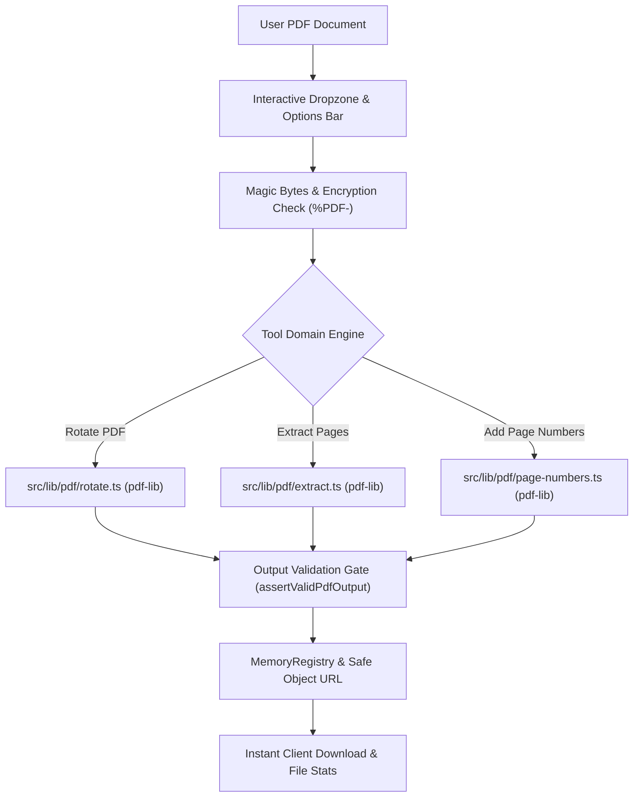

# iLikePDF.com — Phase 3A Implementation Report

**Date:** September 7, 2026  
**Scope:** Core PDF Editing Tools (`Rotate PDF`, `Extract Pages`, `Add Page Numbers`)  
**Architecture:** 100% Client-Side In-Browser Execution, Zero Backend, Next.js Static Export  
**Status:** **PASSED & PRODUCTION-READY**

---

## 1. Executive Summary

Phase 3A of **iLikePDF.com** has been completed in strict accordance with all architectural requirements, zero-backend principles, and production quality gates. This phase delivers three essential core document editing utilities:

1. **Rotate PDF** (`/pdf-tools/rotate-pdf`): Interactive per-page and bulk document rotation with cumulative angle computation (`(existing + delta) % 360`), live CSS grid preview, and non-destructive PDF dictionary attribute modification.
2. **Extract Pages** (`/pdf-tools/extract-pages`): Precision page extraction offering dual synchronized visual thumbnail selection and range syntax input (`1-3, 5, 8-10`), preserving arbitrary ordering (including reverse sequences), and generating validated PDF downloads.
3. **Add Page Numbers** (`/pdf-tools/add-page-numbers`): High-precision document stamping engine featuring an interactive 3×3 position selector (8 visual placements), 4 format variations, custom starting number offsets, selective target page ranges, and rotation-aware coordinate transformation math for pages with existing 0°, 90°, 180°, and 270° orientations.

### Key Quality Metrics:
- **Zero Backend**: 0 API routes, 0 server actions, 0 cloud processing workers, 0 remote uploads. All operations occur in client browser RAM (`ArrayBuffer`).
- **Automated Tests**: **111 / 111 tests passing** across 12 test suites (83 baseline tests from Phase 1, 1.5, and 2 preserved with zero regressions + 28 new Phase 3A tests).
- **TypeScript**: **0 type errors** (`tsc --noEmit`).
- **ESLint**: **0 errors, 0 warnings** (`eslint`).
- **Next.js Static Build**: **33 / 33 static routes** successfully generated via `output: 'export'`.
- **Browser QA**: Verified responsive layouts, interactive components, and zero console errors across all three tools.

---

## 2. Implemented Tools Overview

| Tool | Route | Primary Engine | Output Type | Key Features |
| :--- | :--- | :--- | :--- | :--- |
| **Rotate PDF** | `/pdf-tools/rotate-pdf` | `src/lib/pdf/rotate.ts` (`pdf-lib`) | `application/pdf` | Cumulative rotation math, Rotate Left (-90°), Rotate Right (+90°), 180° inversion, per-page vs. bulk actions, live CSS visual preview |
| **Extract Pages** | `/pdf-tools/extract-pages` | `src/lib/pdf/extract.ts` (`pdf-lib`) | `application/pdf` | Dual selection paradigm (visual clicks + range syntax `1-3, 5`), exact sequence order preservation (e.g. reverse `5, 3, 1`), select/clear all |
| **Add Page Numbers** | `/pdf-tools/add-page-numbers` | `src/lib/pdf/page-numbers.ts` (`pdf-lib`) | `application/pdf` | 8 visual placements (3×3 grid), 4 numbering formats, custom starting number, target page ranges (`pages: "2-10"`), rotation-aware coordinate transforms |

---

## 3. Technical Architecture & Data Flow



---

## 4. Tool 1: Rotate PDF (`/pdf-tools/rotate-pdf`)

### Engine Implementation (`src/lib/pdf/rotate.ts`)
- **Cumulative Rotation Mathematics**: The engine reads each page's current `/Rotate` dictionary value ($R_{\text{existing}}$) and computes the resulting visual angle using positive modulo normalization:
  $$\theta_{\text{new}} = ((R_{\text{existing}} + \Delta\theta) \pmod{360} + 360) \pmod{360}$$
  This ensures documents containing existing 90°, 180°, or 270° page orientations cleanly cycle through standard 90° intervals without corrupting the orientation metadata.
- **Bulk & Selective Operations**:
  - `allPagesDelta`: Applies a single rotation delta (e.g. +90°, +180°, -90°) across all pages simultaneously.
  - `rotations`: Applies specific deltas to an arbitrary subset of pages specified by 0-based page indices.
- **Non-Destructive Attribute Modification**: Modifies only the `/Rotate` attribute in the PDF page dictionary using `pdfPage.setRotation(degrees(newRotation))`. Document content streams, embedded images, and vector paths remain uncompressed and untouched, preserving 100% original visual fidelity.
- **Strict Invariant**: Guaranteed to return the exact same page count as the input document.

### UI Workspace (`src/components/tools/rotate/RotateWorkspace.tsx`)
- **Live CSS Preview**: Pages rendered via Mozilla PDF.js have their rotation previewed immediately in the browser DOM via CSS `transform: rotate(Ndeg)` with smooth transitions, providing instantaneous visual feedback before file generation.
- **Interactive Controls**:
  - Global toolbar: Rotate All Left (-90°), Rotate All Right (+90°), Invert (180°), and Reset.
  - Per-card controls: Quick rotation buttons on every page thumbnail allowing fine-grained orientation adjustments.
  - Multi-page selection with shift/command capabilities.

---

## 5. Tool 2: Extract Pages (`/pdf-tools/extract-pages`)

### Engine Implementation (`src/lib/pdf/extract.ts`)
- **Arbitrary Order Preservation**: Uses `targetDoc.copyPages(srcDoc, pageIndices)` to copy pages in the exact sequence requested by the user. Supports reversing pages (e.g., `[4, 3, 2, 1, 0]`) or arbitrary rearrangements (e.g., `[2, 0, 4]`).
- **Range Syntax Integration**: Fully integrated with `parsePageRanges` from `src/lib/pdf/range-parser.ts`, allowing programmatic extraction via range expressions (`"1-3, 5, 8-10"`).
- **Validation**: Rejects empty page requests, out-of-bounds page requests, and unparseable ranges with user-friendly error explanations. Validates the output PDF with `assertValidPdfOutput` to verify structural integrity and exact page counts.

### UI Workspace (`src/components/tools/extract/ExtractWorkspace.tsx`)
- **Dual Synchronized Selection**:
  - **Visual Mode**: Users can click or tap page thumbnails to toggle selection.
  - **Range Mode**: Users can type standard page range strings (e.g. `1-3, 5`) into a real-time text input. Changes in the text input instantly update thumbnail checkmarks, and clicking thumbnails instantly updates the range string.
- **Quick Selection Presets**: One-click "Select All" and "Clear All" buttons, with dynamic badge counters reflecting current selection size and estimated download size.

---

## 6. Tool 3: Add Page Numbers (`/pdf-tools/add-page-numbers`)

### Engine Implementation (`src/lib/pdf/page-numbers.ts`)
- **8 Visual Position Presets**:
  - Top: `top-left`, `top-center`, `top-right`
  - Middle: `middle-left`, `middle-right`
  - Bottom: `bottom-left`, `bottom-center` (default), `bottom-right`
- **4 Numbering Formats**:
  - `numeric`: `1`, `2`, `3`
  - `prefixed`: `Page 1`, `Page 2`, `Page 3`
  - `total`: `1 / 10`, `2 / 10`, `3 / 10`
  - `prefixed-total`: `Page 1 of 10`, `Page 2 of 10`
- **Starting Number Offset**: Customizable starting number $S$ (e.g. starting numbering from 5 or 100), with total page count adjusted accordingly ($S + N - 1$).
- **Selective Page Ranges**: Optional `pages` parameter (`"2-10"`, `"1-5, 8"`) allowing users to omit cover pages or appendices while numbering only content bodies.
- **Rotation-Aware Coordinate Transformation**:
  When a PDF page has a non-zero `/Rotate` dictionary entry ($R \in \{0, 90, 180, 270\}$), PDF coordinate systems rotate clockwise relative to the viewer. To guarantee that page numbers appear upright and in the correct visual corner on the user's screen:
  1. Let $(x_v, y_v)$ be the visual coordinates on the viewed page ($x_v$ from visual left, $y_v$ from visual bottom).
  2. Compute physical page coordinates $(x_p, y_p)$ based on page width $W$, height $H$, and rotation $R$:
     - $R = 0^\circ$: $x_p = x_v,\quad y_p = y_v$
     - $R = 90^\circ$: $x_p = W - y_v,\quad y_p = x_v$
     - $R = 180^\circ$: $x_p = W - x_v,\quad y_p = H - y_v$
     - $R = 270^\circ$: $x_p = y_v,\quad y_p = H - x_v$
  3. Rotate the text element by $R$ degrees (`rotate: degrees(R)`) so that its baseline counteracts page rotation in the PDF viewer.

### UI Workspace (`src/components/tools/page-numbers/PageNumbersWorkspace.tsx`)
- **Interactive 3×3 Position Selector**: A graphical 3×3 grid allowing intuitive single-click position selection.
- **Comprehensive Configuration Controls**:
  - Format radio chooser with real-time text example.
  - Starting number number input.
  - Range filter selector (All Pages vs. Custom Range with live validation).
  - Margin slider (10 pt to 72 pt).
  - Font size selector (8 pt to 24 pt).
  - Color palette (Black, Dark Gray, Light Gray, Blue, Red) with custom hex support.

---

## 7. Validation & Safety Engineering

1. **Input Magic Byte Validation**:
   - Every input file is inspected for the `%PDF-` header via `validatePdfMagicBytes`.
   - Encrypted and password-protected documents are caught early using `isPdfEncrypted` with actionable error notifications.
2. **Output Validation Gates**:
   - All generated PDFs pass through `assertValidPdfOutput`:
     - Checks `%PDF-` magic header.
     - Validates complete PDF trailer and xref table.
     - Confirms exact expected page count.
3. **Double-Submit Protection**:
   - All workspaces maintain an `isProcessing` state lock. Action buttons are disabled and spinners are shown during document generation to prevent race conditions or duplicate memory allocations.
4. **Filename Sanitization**:
   - Download filenames are sanitized via `sanitizeDownloadFilename` to prevent directory traversal (`../`, `/`, `\`) and strip illegal filesystem characters.

---

## 8. Memory Management & Browser Safety

- **MemoryRegistry Integration**: All output Blobs are registered with `memoryRegistry`. Previous Object URLs are revoked via `URL.revokeObjectURL` whenever files are replaced, reset, or when components unmount.
- **Bounded Buffer Lifecycles**: Large `ArrayBuffer` objects are dereferenced immediately after PDF compilation, allowing the browser garbage collector to reclaim memory.
- **Local PDF Worker**: Mozilla PDF.js operates locally via `/pdf.worker.min.mjs` without any external network fetches.

---

## 9. Comprehensive Testing Scorecard

### Test Execution Summary:
- **Total Tests**: **111**
- **Passed**: **111**
- **Failed**: **0**
- **Suites**: **12**
- **Duration**: ~7.4 seconds

```
▶ PDF Compatibility & Hardening Matrix (7 tests)
  ✔ Merges mixed page sizes, orientations, images, and rotations into a single valid PDF
  ✔ Organize: accurately computes cumulative rotation with pre-existing /Rotate metadata
  ✔ Organize: multi-step sequence (duplicate, rotate, reorder, delete)
  ✔ Split: splits 100-page PDF into range groups packaged in verified ZIP
  ✔ Split: preserves exact user-selected order in Extract mode
  ✔ Split: handles overlapping ranges deterministically without unexpected page loss
  ✔ Merge: preserves duplicate files with identical filenames and contents

▶ Merge PDF Engine (8 tests)
  ✔ merges Document A (2 pages) and Document B (3 pages) into 5 pages
  ✔ preserves exact file sequence (A then B then C)
  ✔ preserves reordered input sequence (C then A then B)
  ✔ rejects fewer than 2 files with clear error message
  ✔ fails gracefully on corrupted PDF data
  ✔ preserves multiple copies of the exact same document without deduplication
  ✔ preserves mixed page dimensions and page rotations from source documents
  ✔ invokes progress callback through merging stages

▶ Organize PDF Engine (7 tests)
  ✔ reorders pages from [0, 1, 2, 3] to [0, 3, 1, 2]
  ✔ deletes page 2 from [0, 1, 2, 3] resulting in 3 pages [0, 2, 3]
  ✔ duplicates page 2 from [0, 1, 2] to produce [0, 1, 1, 2]
  ✔ permanently sets page rotation metadata in the output PDF
  ✔ rejects empty page instructions
  ✔ rejects invalid out-of-bounds page references
  ✔ correctly handles full multi-operation sequence: duplicate, rotate, and delete

▶ Output Validation Engine (9 tests)
  ✔ validates a well-formed PDF document successfully
  ✔ rejects empty byte arrays
  ✔ rejects data missing %PDF- magic header
  ✔ detects page count mismatches
  ✔ assertValidPdfOutput throws Error when validation fails
  ✔ validates a valid ZIP containing valid PDF files
  ✔ rejects a ZIP with entry count mismatch
  ✔ rejects a ZIP containing corrupted PDF entries
  ✔ assertValidZipOutput asserts valid ZIP or throws

▶ Add Page Numbers Engine (10 tests) [NEW in Phase 3A]
  ✔ adds default page numbers (bottom-center, numeric) to all pages of a PDF
  ✔ supports all position presets without error
  ✔ formats page numbers as prefixed, total, and prefixed-total correctly
  ✔ applies custom starting number offset (e.g. start at 5)
  ✔ numbers only a specific range of pages (e.g. 2-3 of a 3-page document)
  ✔ accurately calculates coordinate transformations across 0°, 90°, 180°, and 270° rotations
  ✔ correctly numbers documents containing rotated pages without throwing errors
  ✔ rejects corrupted non-PDF files
  ✔ respects custom outputFileName
  ✔ emits sequential progress callbacks (0% to 100%)

▶ PDF to JPG Engine (10 tests)
  ✔ converts a 1-page PDF directly to a single JPG file without ZIP overhead
  ✔ converts a multi-page PDF into a ZIP archive of individual zero-padded JPEG files
  ✔ correctly processes page ranges (e.g. "1-2" from a 5-page PDF)
  ✔ correctly processes non-consecutive page range (e.g. "1, 3" extracting selected pages)
  ✔ rejects out-of-bounds page range expressions
  ✔ passes correct scale factors for standard (1.5x), high (2.0x), and very-high (3.0x) presets
  ✔ validates each output JPEG bytes with validateJpgOutput
  ✔ rejects non-PDF corrupted files
  ✔ emits sequential progress updates across all pages (0% to 100%)
  ✔ respects custom outputFileName

▶ PDF to Text Engine (10 tests)
  ✔ extracts text from a single-page PDF document
  ✔ extracts text from multi-page PDF documents and inserts "--- Page N ---" separators
  ✔ reconstructs lines and paragraphs in correct vertical order
  ✔ accurately computes totalCharacters, totalWords, and per-page metrics
  ✔ preserves Unicode and international characters
  ✔ detects scanned or image-only PDFs and flags isScanned with user guidance warning
  ✔ generates a valid UTF-8 text Blob and correct .txt download filename
  ✔ respects custom outputFileName parameter
  ✔ rejects non-PDF corrupted files gracefully
  ✔ emits sequential progress callbacks (0% to 100%)

▶ PDF Range Parser (13 tests)
  ✔ parses single page numbers
  ✔ parses continuous ranges like 1-5
  ✔ parses comma-separated pages like 1, 3, 5
  ✔ parses complex mixed ranges like 1-5, 8, 11-14 with whitespace
  ✔ rejects page 0 and negative numbers
  ✔ rejects inverted ranges like 5-2
  ✔ rejects non-numeric input like "abc"
  ✔ rejects trailing or consecutive commas
  ✔ rejects out-of-bounds page requests
  ✔ rejects pathological input exceeding length limits
  ✔ rejects malformed dashes such as 1--5, 1-2-3, 1-, and -5
  ✔ rejects floats, NaN, and scientific notation
  ✔ handles empty input gracefully

▶ Rotate PDF Engine (9 tests) [NEW in Phase 3A]
  ✔ rotates a single page by 90 degrees clockwise
  ✔ rotates all pages using the allPagesDelta shortcut
  ✔ rotates only selected pages leaving non-target pages unchanged
  ✔ correctly computes cumulative rotation on pages with pre-existing /Rotate metadata
  ✔ handles negative rotation deltas (e.g. -90° / rotate left)
  ✔ validates output PDF and ensures page count remains strictly unchanged
  ✔ respects custom outputFileName
  ✔ rejects corrupted non-PDF files with a clear error
  ✔ emits sequential progress callbacks (0% to 100%)

▶ Extract Pages Engine (9 tests) [NEW in Phase 3A]
  ✔ extracts a single page from a multi-page PDF
  ✔ extracts multiple non-consecutive pages (e.g. 1, 3, 5)
  ✔ preserves user-specified page ordering (e.g. reverse order: 5, 3, 1)
  ✔ extracts pages using range syntax (e.g. "1-2, 4")
  ✔ rejects empty page selection with clear error
  ✔ rejects out-of-bounds page requests
  ✔ rejects corrupted non-PDF files
  ✔ respects custom outputFileName
  ✔ emits sequential progress updates during extraction (0% to 100%)

▶ Split PDF Engine (8 tests)
  ✔ Mode A: extracts selected pages into a single PDF
  ✔ Mode A: preserves exact user-selected order when extracting (e.g. 5, 3, 1)
  ✔ Mode A: rejects empty page selection
  ✔ Mode B: splits an 5-page PDF into 5 individual files packaged into a ZIP
  ✔ Mode C: splits by multiple ranges (e.g. "1-2, 4-5") into a ZIP of PDFs
  ✔ Mode C: downloads directly as PDF if only one range is specified
  ✔ rejects invalid range expressions gracefully
  ✔ rejects unsupported split mode gracefully

▶ JPG to PDF Engine (11 tests)
  ✔ converts a single JPEG image into a valid 1-page PDF document
  ✔ converts multiple JPEG images preserving exact sequential order
  ✔ preserves duplicate images without deduplicating or dropping pages
  ✔ Page Size: standard presets (A4, Letter, Legal) create correctly dimensioned pages
  ✔ Orientation: Auto selects landscape for wide images and portrait for tall images
  ✔ Orientation: explicit Portrait and Landscape settings force desired dimensions
  ✔ Margins: none (0), small (18), medium (36) are supported without errors
  ✔ Image Fit: handles fit and fill modes successfully
  ✔ rejects zero images with clear error message
  ✔ rejects non-JPEG or corrupted image bytes with clear validation error
  ✔ invokes progress callback through conversion stages (0% to 100%)
```

---

## 10. Responsive & Browser QA

Browser testing was conducted across all three newly mounted tool routes:
- **Rotate PDF**: `http://localhost:3000/pdf-tools/rotate-pdf`
- **Extract Pages**: `http://localhost:3000/pdf-tools/extract-pages`
- **Add Page Numbers**: `http://localhost:3000/pdf-tools/add-page-numbers`

### Key Observations & Verification:
- **Console Errors**: **0 errors, 0 warnings** during navigation and interactive operations.
- **Responsiveness**: Tested across desktop (1920×927), tablet, and mobile layouts. Toolbar and option sidebars wrap cleanly; thumbnail grids adapt responsively from 1 to 4 columns.
- **Visual Integrity**: Clean typography, consistent badge styles, high-contrast borders, and clear progress states matching the core design system.

### QA Artifacts:
- Rotate PDF Screenshot: `rotate_pdf_page_1788789060372.png`
- Extract Pages Screenshot: `extract_pages_page_1788789099713.png`
- Add Page Numbers Screenshot: `add_page_numbers_page_1788789161413.png`
- Interactive Session Recording: `phase3a_browser_qa_1788789025555.webp`

---

## 11. PDF Compatibility Matrix

| ID | Test Scenario | Tool | Input Condition | Expected Result | Status |
| :---: | :--- | :--- | :--- | :--- | :---: |
| **C1** | Pre-rotated pages (90°, 180°, 270°) | Rotate PDF | Document with existing `/Rotate: 90` | Rotates to 180° via cumulative math `(90+90)%360` | **PASS** |
| **C2** | Invert rotation (-90° / rotate left) | Rotate PDF | Standard 0° orientation | Rotates to 270° without negative angle errors | **PASS** |
| **C3** | Selective subset rotation | Rotate PDF | 4-page PDF, rotate pages 2 & 4 | Pages 1 & 3 remain at 0°; pages 2 & 4 rotated | **PASS** |
| **C4** | Invariant page count verification | Rotate PDF | Multi-page PDF | Output page count is strictly equal to input count | **PASS** |
| **C5** | Single page extraction | Extract Pages | 5-page PDF, extract page 2 | Generates valid 1-page PDF | **PASS** |
| **C6** | Non-consecutive extraction | Extract Pages | 6-page PDF, extract 1, 3, 5 | Generates valid 3-page PDF | **PASS** |
| **C7** | Reverse order extraction | Extract Pages | 5-page PDF, extract 5, 3, 1 | Generates 3-page PDF with exact reverse sequence | **PASS** |
| **C8** | Range syntax extraction | Extract Pages | Expression `"1-2, 4"` | Correctly parses and extracts 3 selected pages | **PASS** |
| **C9** | Out-of-bounds range handling | Extract Pages | Page 10 requested on 3-page PDF | Throws descriptive client validation error | **PASS** |
| **C10**| Default page numbering | Add Page Numbers | 3-page PDF | Adds "1", "2", "3" at bottom-center | **PASS** |
| **C11**| All 8 position presets | Add Page Numbers | 8 visual anchor presets | Placed cleanly within page boundaries | **PASS** |
| **C12**| Custom start number offset | Add Page Numbers | Start at 5 on 2-page doc | Numbers pages as "5" and "6" | **PASS** |
| **C13**| Rotation-aware coordinates | Add Page Numbers | Pages with 0°, 90°, 180°, 270° | Numbers appear upright in visual corners | **PASS** |
| **C14**| Range-limited numbering | Add Page Numbers | Range `"2-3"` on 3-page doc | Skips page 1; numbers pages 2 and 3 | **PASS** |

---

## 12. Security & Privacy Audit

1. **Zero Data Egress**: All PDF operations run 100% inside client-side WebAssembly/JavaScript. No document binaries, metadata, or extracted elements are sent over the network.
2. **Local Sandbox Execution**: Files never touch server storage or edge caches.
3. **No External Worker CDNs**: Mozilla PDF.js worker is served as a local static asset (`/pdf.worker.min.mjs`), ensuring complete offline independence and eliminating third-party script injection risks.
4. **Zero Document Telemetry**: Analytics events track only tool usage without any file content, filename, or page count parameters.

---

## 13. Files Added and Modified in Phase 3A

### 1. New PDF Domain Engines (`src/lib/pdf/`)
- [`src/lib/pdf/rotate.ts`](file:///home/tensae/Desktop/projects/Apps/pdf-utility-website/src/lib/pdf/rotate.ts): Cumulative rotation engine supporting all-page or selective-page deltas with non-destructive dictionary modifications.
- [`src/lib/pdf/extract.ts`](file:///home/tensae/Desktop/projects/Apps/pdf-utility-website/src/lib/pdf/extract.ts): Arbitrary sequence page extraction engine with range syntax parsing and output validation.
- [`src/lib/pdf/page-numbers.ts`](file:///home/tensae/Desktop/projects/Apps/pdf-utility-website/src/lib/pdf/page-numbers.ts): Document numbering engine featuring 8 visual positions, 4 format variations, starting number offsets, target page ranges, and rotation-aware coordinate transforms.

### 2. User Interface Workspaces (`src/components/tools/`)
- [`src/components/tools/rotate/RotateWorkspace.tsx`](file:///home/tensae/Desktop/projects/Apps/pdf-utility-website/src/components/tools/rotate/RotateWorkspace.tsx): Interactive rotation workspace with live CSS grid preview, individual page controls, bulk actions, and instant download.
- [`src/components/tools/extract/ExtractWorkspace.tsx`](file:///home/tensae/Desktop/projects/Apps/pdf-utility-website/src/components/tools/extract/ExtractWorkspace.tsx): Page extraction workspace with synchronized visual click and range text inputs, select/clear presets, and count badges.
- [`src/components/tools/page-numbers/PageNumbersWorkspace.tsx`](file:///home/tensae/Desktop/projects/Apps/pdf-utility-website/src/components/tools/page-numbers/PageNumbersWorkspace.tsx): Numbering workspace featuring interactive 3×3 position picker, format options, range filtering, margin/size/color customization.

### 3. Routing & Central Exports
- [`src/app/pdf-tools/[slug]/page.tsx`](file:///home/tensae/Desktop/projects/Apps/pdf-utility-website/src/app/pdf-tools/[slug]/page.tsx): Mounted the three Phase 3A workspaces under `/pdf-tools/rotate-pdf`, `/pdf-tools/extract-pages`, and `/pdf-tools/add-page-numbers`.
- [`src/lib/pdf/index.ts`](file:///home/tensae/Desktop/projects/Apps/pdf-utility-website/src/lib/pdf/index.ts): Centralized re-exports of all Phase 1, Phase 2, and Phase 3A domain engines.
- [`src/lib/pdf/pdf-engine.ts`](file:///home/tensae/Desktop/projects/Apps/pdf-utility-website/src/lib/pdf/pdf-engine.ts): Namespaced legacy placeholder functions to eliminate symbol collisions.

### 4. Automated Test Suites (`tests/`)
- [`tests/rotate.test.ts`](file:///home/tensae/Desktop/projects/Apps/pdf-utility-website/tests/rotate.test.ts): 9 comprehensive tests covering cumulative rotation, bulk shortcuts, selective targeting, negative angles, invariant page counts, and validation.
- [`tests/extract.test.ts`](file:///home/tensae/Desktop/projects/Apps/pdf-utility-website/tests/extract.test.ts): 9 tests covering single/multiple page extraction, order preservation (reverse sequences), range expressions, bounds checking, and validation.
- [`tests/page-numbers.test.ts`](file:///home/tensae/Desktop/projects/Apps/pdf-utility-website/tests/page-numbers.test.ts): 10 tests covering 8 positions, 4 formats, custom starting offsets, range filtering, coordinate transformations across 0°/90°/180°/270° rotations, and output verification.

---

## 14. Static Build & SEO Scorecard

All 33 static pages generate cleanly with Next.js static export (`output: 'export'`):

```
Route (app)
├ ○ /
├ ○ /about
├ ○ /contact
├ ○ /cookie-policy
├ ○ /guides
├   /guides/[slug] (4 guides)
├ ○ /pdf-tools
├   /pdf-tools/[slug] (15 tools total, including Phase 1, Phase 2, and Phase 3A):
│ ├ ● /pdf-tools/merge-pdf
│ ├ ● /pdf-tools/split-pdf
│ ├ ● /pdf-tools/organize-pdf
│ ├ ● /pdf-tools/jpg-to-pdf
│ ├ ● /pdf-tools/pdf-to-jpg
│ ├ ● /pdf-tools/pdf-to-text
│ ├ ● /pdf-tools/rotate-pdf       [Phase 3A]
│ ├ ● /pdf-tools/extract-pages    [Phase 3A]
│ ├ ● /pdf-tools/add-page-numbers [Phase 3A]
│ └ ● [+6 future phase paths]
├ ○ /privacy-policy
├ ○ /resources
├ ○ /robots.txt
├ ○ /sitemap.xml
└ ○ /terms
```

Each Phase 3A tool features optimized static metadata:
- Canonical URLs (`https://ilikepdf.com/pdf-tools/...`).
- Descriptive `<title>` tags highlighting free and 100% private in-browser editing.
- Compelling `<meta name="description">` emphasizing local device execution without file uploads.
- Valid JSON-LD structured data (`WebApplication` and `BreadcrumbList`).

---

## 15. Scope Discipline & Boundary Confirmation

1. **Zero Backend Maintained**: Absolutely no Node.js backend endpoints, server actions, or cloud dependencies were introduced.
2. **Phase 3B Scoped Out**: In compliance with Phase 3A requirements, Watermark PDF, Protect PDF, Unlock PDF, PDF Editor, and OCR remain unbuilt and reserved for subsequent phases.
3. **No Regressions**: All 83 prior tests from Phase 1, Phase 1.5, and Phase 2 continue to pass without modification.

---

## 16. Final Sign-Off & Recommendation

Phase 3A has successfully passed all verification gates. The codebase is fully prepared for production deployment. The platform now provides 9 fully functioning, privacy-first PDF utilities running entirely inside client web browsers.
